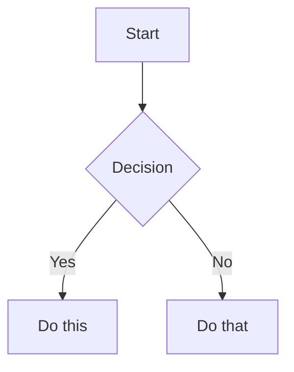

# markdown-it-govuk-components

A [markdown-it](https://github.com/markdown-it/markdown-it) plugin that adds support for [GOV.UK Design System](https://design-system.service.gov.uk/) components in markdown.

## ⚠️ Important Note

This plugin generates HTML with GOV.UK Design System CSS classes. **You must include the GOV.UK Frontend CSS and JavaScript in your project** for proper styling and functionality.

```html
<!-- In your HTML -->
<link rel="stylesheet" href="https://unpkg.com/govuk-frontend@5.0.0/dist/govuk/govuk-frontend.min.css">
<script src="https://unpkg.com/govuk-frontend@5.0.0/dist/govuk/govuk-frontend.min.js"></script>
<script>window.GOVUKFrontend.initAll()</script>
```

Or install via npm:
```bash
npm install govuk-frontend
```

## Installation

```bash
npm install markdown-it-govuk-components
```

## Usage

```javascript
const md = require('markdown-it')();
const govukComponents = require('markdown-it-govuk-components');

md.use(govukComponents);

const result = md.render('# Hello GOV.UK');
```

## Features

This plugin automatically adds GOV.UK Design System classes to standard markdown elements and provides custom syntax for GOV.UK components.

### Automatic Styling

- **Headings**: Automatically styled with GOV.UK typography classes
  - `h1` → `govuk-heading-xl`
  - `h2` → `govuk-heading-l`
  - `h3` → `govuk-heading-m`
  - `h4` → `govuk-heading-s`
- **Paragraphs**: Styled with `govuk-body`
- **Links**: Styled with `govuk-link`
- **Lists**: Styled with `govuk-list` classes
- **Tables**: Styled with `govuk-table` classes

### Container Components

#### Warning Text
```markdown
:::warning
This is a warning message
:::
```

#### Inset Text
```markdown
:::inset
This is inset text
:::
```

#### Details (Accordion)
```markdown
:::details
Summary text here
---
Hidden content that can be revealed
:::
```

#### Notification Banner
```markdown
:::notification
This is an important notification
:::

:::notification success
This is a success notification
:::
```

#### Error Summary
```markdown
:::error
There is a problem with your submission
:::
```

#### Panel
```markdown
:::panel
Panel Title
Panel body content
:::

:::panel confirmation
Application complete
Your reference number is ABC123
:::
```

### Interactive Components

#### Buttons
```markdown
[!button Start now](#)
[!button:secondary Cancel](#)
[!button:warning Delete](#)
[!button:start Continue](#)
```

#### Tags
```markdown
[!tag Alpha]
[!tag:green Completed]
[!tag:red Urgent]
```

Valid tag colors: `grey`, `green`, `turquoise`, `blue`, `purple`, `pink`, `red`, `orange`, `yellow`

#### Phase Banner
```markdown
[!phase:alpha]
[!phase:beta]
```

### Form Components

#### Text Input
```markdown
[!input:text "Full name" name="fullname" hint="Enter your full name"]
[!input:email "Email address" name="email"]
[!input:tel "Phone number" name="phone"]
```

#### Textarea
```markdown
[!input:textarea "Tell us more" name="details" hint="Provide additional information"]
```

#### Radio Buttons
```markdown
:::radio-group "How would you prefer to be contacted?" name="contact-preference"
[!radio "Email" name="contact-preference" value="email"]
[!radio "Phone" name="contact-preference" value="phone"]
[!radio "Text message" name="contact-preference" value="text"]
:::
```

#### Checkboxes
```markdown
:::checkbox-group "Which services are you interested in?" name="services"
[!checkbox "Council tax" name="services" value="council-tax"]
[!checkbox "Housing" name="services" value="housing"]
[!checkbox "Benefits" name="services" value="benefits"]
:::
```

#### Select Dropdown
```markdown
[!select "Choose your country" name="country" options="England,Scotland,Wales,Northern Ireland"]
```

### Mermaid Diagram Support

The plugin supports Mermaid diagrams with GOV.UK styling:

````markdown

````

**Note**: You'll need to include Mermaid JS separately:
```html
<script src="https://cdn.jsdelivr.net/npm/mermaid/dist/mermaid.min.js"></script>
<script>mermaid.initialize({ startOnLoad: true });</script>
```

## Complete Example

```markdown
# Service Name

This service helps you [do something].

:::warning
You must be over 18 to use this service.
:::

## Before you start

You will need:
- Your National Insurance number
- A valid UK passport

[!button:start Start now](#)

:::details
Help with National Insurance numbers
---
Your National Insurance number is on your National Insurance card, benefit letter, payslip or P60.
:::

## Your details

[!input:text "Full name" name="full-name" hint="As shown on your passport"]

[!input:email "Email address" name="email" hint="We'll use this to send you a confirmation"]

:::radio-group "Do you have a UK passport?" name="passport"
[!radio "Yes" name="passport" value="yes"]
[!radio "No" name="passport" value="no"]
:::

[!button Continue](#)
[!button:secondary Save and come back later](#)
```

## Integration Examples

### With Express.js
```javascript
const express = require('express');
const md = require('markdown-it')();
const govukComponents = require('markdown-it-govuk-components');

md.use(govukComponents);

app.get('/page', (req, res) => {
  const html = md.render(markdownContent);
  res.render('template', { content: html });
});
```

### With Static Site Generators

#### Eleventy
```javascript
// .eleventy.js
const md = require('markdown-it')();
const govukComponents = require('markdown-it-govuk-components');

md.use(govukComponents);

module.exports = function(eleventyConfig) {
  eleventyConfig.setLibrary('md', md);
};
```

#### Next.js
```javascript
import MarkdownIt from 'markdown-it';
import govukComponents from 'markdown-it-govuk-components';

const md = new MarkdownIt();
md.use(govukComponents);

export default function Page({ content }) {
  return (
    <div dangerouslySetInnerHTML={{ __html: md.render(content) }} />
  );
}
```

## API

### Plugin Options

Currently, the plugin doesn't accept any options:

```javascript
md.use(govukComponents);
```

Future versions may include options for customization.

## Browser Support

This plugin generates HTML that's compatible with the browsers supported by the GOV.UK Design System:
- Chrome (latest 2 versions)
- Firefox (latest 2 versions)
- Safari (latest 2 versions)
- Edge (latest 2 versions)

## Development

```bash
# Install dependencies
npm install

# Run tests
npm test

# Run demo
npm run demo

# View demo at examples/demo.html
```

## License

MIT © James Carruthers

## Acknowledgments

This plugin is designed to work with the [GOV.UK Design System](https://design-system.service.gov.uk/) and requires [GOV.UK Frontend](https://github.com/alphagov/govuk-frontend).

## Related Projects

- [govuk-frontend](https://github.com/alphagov/govuk-frontend) - GOV.UK Frontend contains the code you need to start building a user interface for government platforms and services
- [markdown-it](https://github.com/markdown-it/markdown-it) - Markdown parser, done right. 100% CommonMark support, extensions, syntax plugins & high speed
